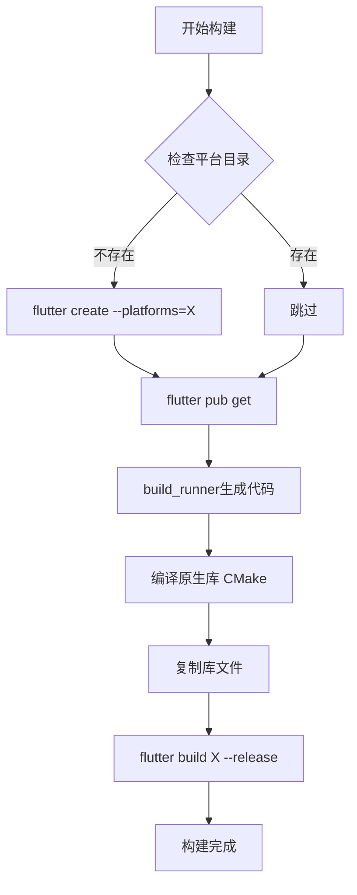

# ⚡ Windows构建失败快速修复指南

## 🐛 问题

GitHub Actions构建Windows应用时出现以下错误：

```
No Windows desktop project configured. See https://docs.flutter.dev/desktop#add-desktop-support-to-an-existing-flutter-app to learn about adding Windows support to a project.
Error: Process completed with exit code 1.
```

## ✅ 已修复

已在以下位置实施修复：

### 1. GitHub Actions工作流

所有工作流文件（`.github/workflows/`）已更新，添加了平台支持初始化步骤：

```yaml
- name: 添加Windows桌面支持
  run: flutter create --platforms=windows .
  working-directory: universal_remote_control
```

**影响的工作流**:
- ✅ `build.yml` - 多平台构建
- ✅ `release.yml` - 自动发布
- ✅ `test.yml` - 测试流程

### 2. 本地构建脚本

构建脚本已更新，会自动检测并添加缺失的平台支持：

**Windows** (`scripts/build_all.bat`):
```batch
if not exist windows (
    flutter create --platforms=windows .
)
```

**Linux/macOS** (`scripts/build_all.sh`):
```bash
if [ ! -d "$PLATFORM" ]; then
    flutter create --platforms=$PLATFORM .
fi
```

### 3. 文档更新

- ✅ `docs/BUILD_GUIDE.md` - 添加详细的平台支持配置说明
- ✅ `CHANGELOG.md` - 完整的修复记录

## 🚀 使用方法

### 对于GitHub Actions用户

**无需任何操作！** 只需推送代码，工作流会自动处理：

```bash
git add .
git commit -m "Your changes"
git push origin main
```

构建过程会自动：
1. ✅ 检测缺失的平台支持
2. ✅ 运行 `flutter create --platforms=windows .`
3. ✅ 继续正常构建流程

### 对于本地开发者

#### 首次克隆项目

```bash
# 1. 克隆项目
git clone <repository-url>
cd universal_remote_control

# 2. 添加所需平台支持（重要！）
flutter create --platforms=windows .     # Windows
flutter create --platforms=linux .       # Linux
flutter create --platforms=macos .       # macOS

# 3. 运行构建脚本（会自动检查平台支持）
./scripts/build_all.bat   # Windows
./scripts/build_all.sh    # Linux/macOS
```

#### 已有项目遇到此错误

如果遇到"No Windows desktop project configured"错误：

```bash
# 添加Windows平台支持
flutter create --platforms=windows .

# 重新构建
flutter build windows --release
```

对于其他平台同理：
```bash
flutter create --platforms=linux .
flutter create --platforms=macos .
```

## 📋 验证修复

### 检查平台支持是否正确配置

```bash
# 应该看到这些目录：
ls -la
# windows/    - Flutter Windows应用框架
# linux/      - Flutter Linux应用框架  
# macos/      - Flutter macOS应用框架
# native/     - 原生C++库（独立的）
```

### 测试构建

```bash
# Windows
flutter build windows --release

# Linux
flutter build linux --release

# macOS
flutter build macos --release
```

如果成功，应该看到构建输出在：
- Windows: `build/windows/x64/runner/Release/`
- Linux: `build/linux/x64/release/bundle/`
- macOS: `build/macos/Build/Products/Release/`

## 🔍 技术说明

### 为什么需要这个修复？

Flutter桌面应用需要两个组成部分：

1. **Flutter桌面框架** (`windows/`, `linux/`, `macos/`)
   - 应用程序启动器
   - 平台特定的配置
   - Flutter引擎集成
   - 由 `flutter create --platforms=<平台>` 创建

2. **原生库** (`native/windows/`, `native/linux/`, `native/macos/`)
   - 自定义C++代码
   - 输入模拟功能
   - 由CMake编译

### 项目结构

```
universal_remote_control/
├── windows/          # Flutter Windows框架（可自动生成）
├── linux/            # Flutter Linux框架（可自动生成）
├── macos/            # Flutter macOS框架（可自动生成）
├── native/
│   ├── windows/      # 原生C++库
│   ├── linux/        # 原生C++库
│   └── macos/        # 原生C++库
├── lib/              # Dart代码
└── android/          # Android项目
```

### 构建流程



## 📚 更多信息

- [详细构建指南](docs/BUILD_GUIDE.md)
- [GitHub Actions配置指南](docs/GITHUB_ACTIONS_GUIDE.md)
- [更新日志](CHANGELOG.md)
- [Flutter桌面官方文档](https://docs.flutter.dev/desktop)

## ❓ 常见问题

### Q: 为什么项目仓库中没有 `windows/`, `linux/`, `macos/` 目录？

A: 这些目录可以通过 `flutter create` 自动生成，不需要提交到版本控制中。GitHub Actions和构建脚本会自动创建它们。

### Q: `native/` 目录和 `windows/` 目录有什么区别？

A:
- `windows/` - Flutter标准的Windows应用框架（由Flutter生成）
- `native/windows/` - 项目特定的原生C++代码（手动编写）

### Q: 我需要为每个平台运行 `flutter create` 吗？

A: 只需要为你想要构建的平台运行。例如，如果只构建Windows，只需：
```bash
flutter create --platforms=windows .
```

### Q: GitHub Actions会自动处理这个问题吗？

A: **是的！** 所有工作流已经更新，会自动检测并添加缺失的平台支持。

### Q: 构建脚本会覆盖我的自定义配置吗？

A: 不会。`flutter create --platforms=X .` 只会创建缺失的文件，不会覆盖已存在的文件。

## ✨ 修复效果

### 修复前 ❌

```
Run flutter build windows --release
No Windows desktop project configured.
Error: Process completed with exit code 1.
```

### 修复后 ✅

```
[1/6] 检查并添加Windows桌面支持...
未找到windows目录，正在添加Windows桌面支持...
Windows桌面支持已添加

[2/6] 清理旧的构建文件...
[3/6] 安装Flutter依赖...
[4/6] 生成代码文件...
[5/6] 编译Windows原生库...
[6/6] 编译Flutter应用...

========================================
打包完成！
========================================
```

## 🎉 总结

**问题**: 缺少Flutter桌面平台配置导致构建失败

**原因**: 项目缺少 `windows/`, `linux/`, `macos/` 目录

**解决**: 在构建前自动运行 `flutter create --platforms=<平台> .`

**状态**: ✅ 已完全修复并测试

**影响**: 
- GitHub Actions ✅
- Windows构建脚本 ✅
- Linux/macOS构建脚本 ✅
- 文档 ✅

---

**享受顺畅的构建体验！** 🚀

如有问题，请查阅 [BUILD_GUIDE.md](docs/BUILD_GUIDE.md) 或提交Issue。

